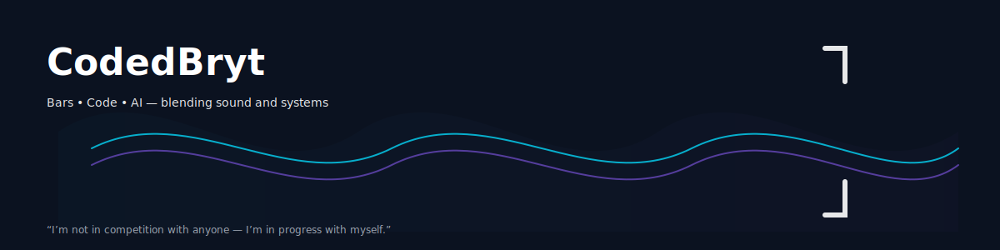

# 👋 Hi, I'm **CodedBryt**

  

💻 **Intern learning AI/ML & Web Development**  
🎤 **Rapper at heart — from bars to codes**  
🚀 Blending creativity through tech, sound, and innovation  

---

### 🧠 About Me
- 🎯 Currently an intern (Week 11) learning **HTML, CSS, JavaScript, and Prompt Engineering**  
- 🤖 Exploring **AI & Machine Learning fundamentals** and **Generative AI tools**  
- 🎓 Certified in *Career Essentials in Generative AI* and *Generative AI Productivity Skills* (Microsoft + LinkedIn)  
- 🌍 Open to **remote roles** and **collaboration opportunities**  
- 🔥 Passionate about merging **art + technology** to build smarter, creative solutions  

---

### 💡 Skills & Tools
**Frontend:** HTML, CSS, JavaScript  
**AI Tools:** ChatGPT, GitHub Copilot, Bing Copilot  
**Other Skills:** Prompt Engineering, Generative AI Basics  
**Currently Learning:** Python for AI/ML  

---

### ⚙️ Projects & Learning Repos
Here’s what I’m building and learning:
- 🧩 **[Web Dev Internship Projects](#)** — My week-by-week progress in HTML, CSS, and JS  
- 💬 **[Prompt Lab](#)** — Experiments with prompts for AI creativity and productivity  
- 🧠 **[AI Concepts Explained](#)** — My notes and breakdowns of key AI & ML ideas  

(*More projects coming soon as I grow in AI/ML.*)

---

### 🎵 Beyond Tech
When I’m not coding, I write and record music — creativity drives everything I do.  
From studio sessions to VS Code, I believe both art and tech are about **building something that speaks**.

---

### 📫 Connect With Me
- 🐦 [Twitter (X)](https://x.com/brytvillz_rapz)  
- 💼 [LinkedIn](https://www.linkedin.com/in/codedbryt-ezeribe-6b257b390)  
- 🌐 [Portfolio/Website (coming soon)](#)  

---

⭐ **“I’m not in competition with anyone — I’m in progress with myself.”**

<!--
**brytvillz/brytvillz** is a ✨ _special_ ✨ repository because its `README.md` (this file) appears on your GitHub profile.

Here are some ideas to get you started:

- 🔭 I’m currently working on ...
- 🌱 I’m currently learning ...
- 👯 I’m looking to collaborate on ...
- 🤔 I’m looking for help with ...
- 💬 Ask me about ...
- 📫 How to reach me: ...
- 😄 Pronouns: ...
- ⚡ Fun fact: ...
-->
